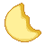
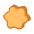
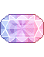
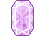
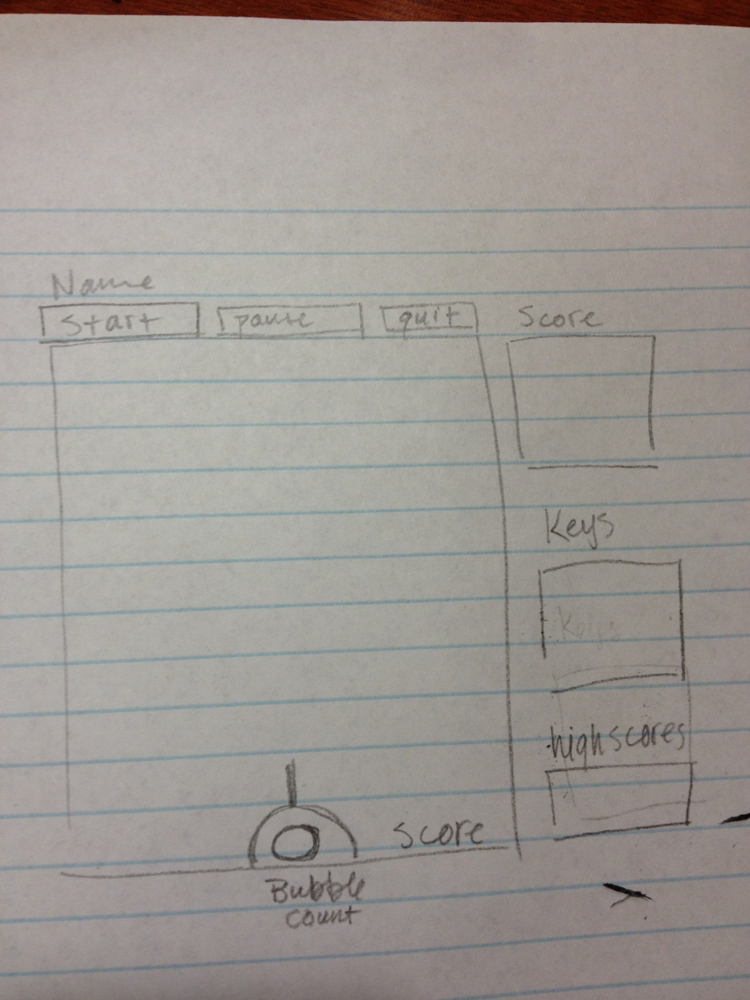

# Cereal Killer
This game is a keybased game that uses the keys x and c to move the player and the m key to attack.

Written by Danielle Hata

----

## Objects
  1. Object A - Balloon
  	* moves straight, at any angle
  	* enters from N W E, exits from S E W
  	* gives 1 crystal and 5 points
  2. Object B - Clover
  	* moves straight. After moving forward 10 paces, begins moving backward by 5 paces, then forward 10 paces again
  	* enters from N W E, exits from S E W 
  	* gives 2 crystals and 8 points
  3. Object C - Diamond
  	* moves zig zag. Moves forward 5 paces, then turns 45 degrees left, moves forward 5 paces, then turns 45 degrees right, repeat
  	* enters from N W E, could exit any side
  	* gives 5 crystals and 20 points
  4. Object D - Moon
  	* moves straight back and forth across the screen, bounces off the sides
  	* enters from the any side, does not exit unless destroyed
  	* gives 4 crystals and 15 points
  5. Object E - Star
  	* moves randomly up, down, left right
  	* doesn't leave the screen. The number of stars cumulates and makes the game harder
  	* dies after being hit 4 times, when it collides with other objects it destroys them
  	* does not give any crystal or point rewards.
  6. Object F - Player (crystal)
  	* moves horizontally on the bottom of the screen.
  	* starts in the middle of the screen
  	* collisions don't matter
  7. Object G - Bullet (small crystal)
  	* move straight North from the center of the player.
  	* each bullet takes one point from the user's life
  	* collision with cereal gives more life

      

Images from [First Fear](http://firstfear.deviantart.com/art/Pixel-LuckyCharms-Icons-269837586?q=gallery%3Afirstfear%2F2084580&qo=27)

## How to Play

There will be a docked gun at the bottom of the screen. You will shoot at the objects with crystals. There is a limited number of crystals, and when you run out of crystals, you die.
For every object you defeat, you get more crystals. There is no penalty for missing killing an object or when an object hits the gun.

### Equip
Uses the keys, x, c, and m
  1. **x** moves the gun to the left
  2. **c** moves the gun to the right
  3. **m** shoots a crystal

## Scoring

Score will increase by how many objects you kill. Points are granted based on the speed of the object killed. Each type of object grants a certain number of crystals. Score cannot go down.

## Lives

Player starts with 50 crystals, decreases 1 crystal for every shot out of the gun, increases crystals by killing objects. Each type of object gives a different crystal reward.
The game ends when the player runs out of crystals.

## Levels

When the player reaches 150 points, then each monster created after that point becomes more robust. In level 2 it takes 2 hits to kill regular objects and 5 to kill stars. At level 3, it takes 3 hits to kill regular objects and 6 to kill stars.
No extra points or crystals are awarded at higher levels.

## UI Layout
| Graphic            | Qt Class    | Location         |
|--------------------|-------------|------------------|
| Start Button       | QPushButton | Right Navigation |
| Pause Button       | QPushButton | Right Navigation |
| Quit Button        | QPushButton | Right Navigation |
| Name Entry         | QLineEdit   | Right Navigation |
| Score              | QText       | Bottom right     |
| Crystal Count      | QText       | Bottom mid       |
| Score/Object Guide | QListView   | Right Navigation |
| Key Instructions   | QListView   | Right Navigation |
| High Score Table   | QListView   | Right Navigation |

